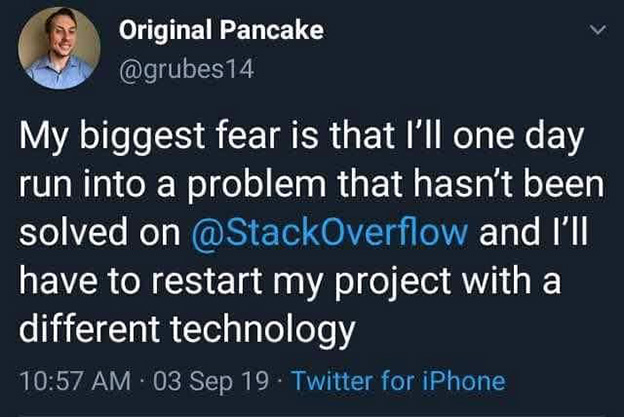
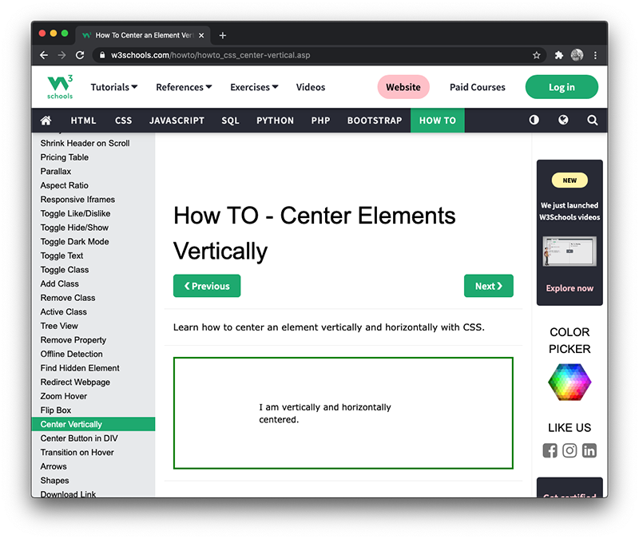
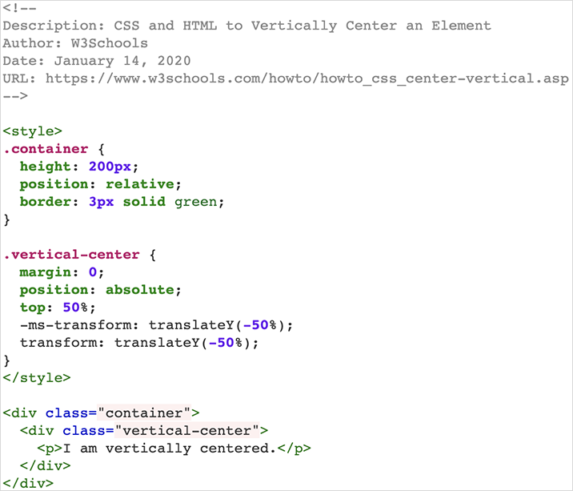
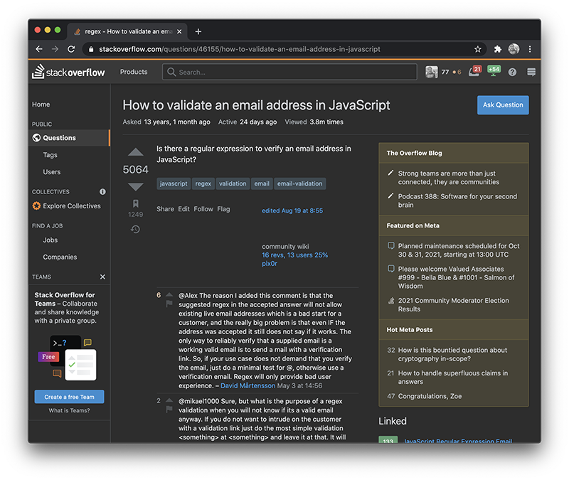
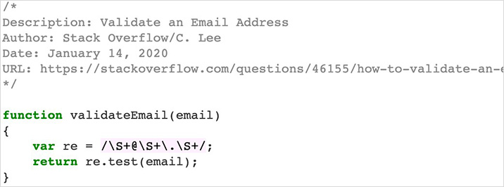
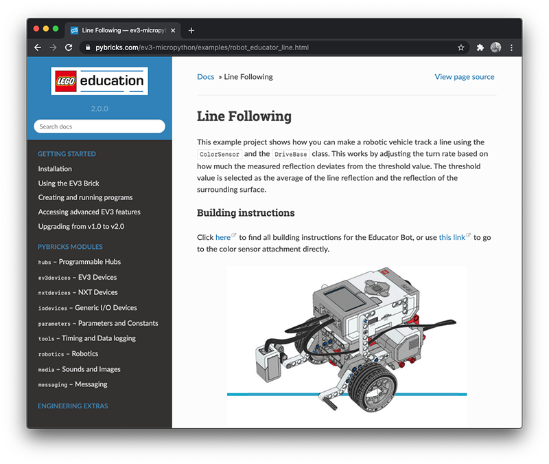
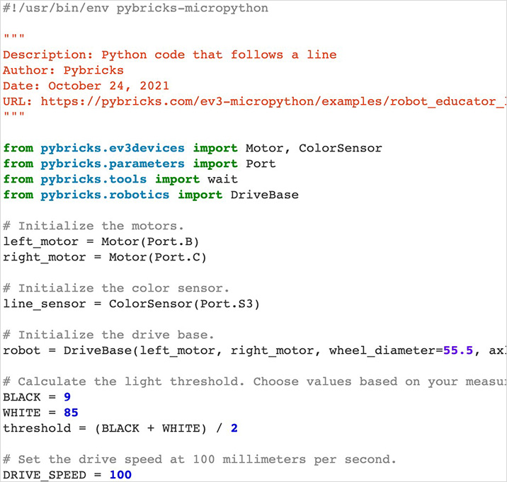
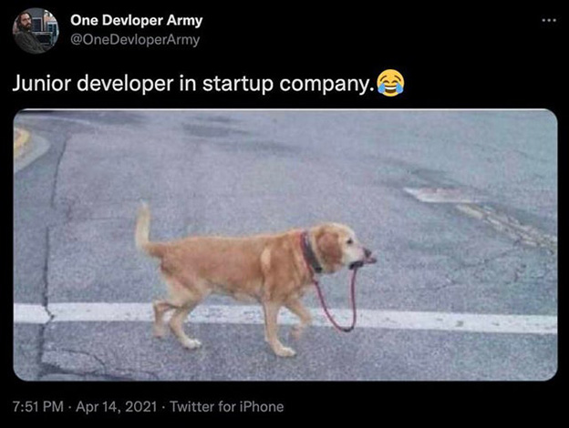

## Chapter 2: Citing Code

Not all code needs to be cited. Which code needs to be cited and which code does not needs to be cited will be covered in the next two chapters.

For now, let's say we have found some code online that we would like to use in an assignment. Let's also assume that a. the code snippet falls under the <a href="https://creativecommons.org/">Creative Commons</a>; and b) the assignment permits the use of code samples. So how do we cite a code snippet?

In your source code, directly above the snippet of code that requires a citation, add a comment including:

1. A description of the source code
2. The author (name, company, and/or screen name)
3. The date it was copied
4. A URL to the page the code was copied from

> <small>Not the First [Digital Image]. 2019. Retrieved from <a href="https://www.reddit.com/r/ProgrammerHumor/">https://www.reddit.com/r/ProgrammerHumor/</a></small>

## Citation Examples

Below are a series of citation examples. The examples include a variety of different languages as the syntax for commenting varies.

For future reference, the three examples below are considered coding examples, not documentation. The differences between documentation and examples is crucial and will be outlined in the next few chapters.

---

### Example 1: HTML and CSS

> <small><a href="https://www.w3schools.com/howto/howto_css_center-vertical.asp">https://www.w3schools.com/howto/howto_css_center-vertical.asp</a>

Below is an HTML and CSS code snippet copied from <a href="https://www.w3schools.com/">W3Schools</a>. This code centers a <code>div</code> element horizontally and vertically on a web page:

> <small><a href="https://www.w3schools.com/howto/howto_css_center-vertical.asp">https://www.w3schools.com/howto/howto_css_center-vertical.asp</a></small>

Note that if the HTML and CSS were placed in two different files, they would both need to be cited separately.

Code from W3Schools is free to use and manipulate. It has been released under the <a href="https://www.copyright.gov/fair-use/more-info.html">Fair Use License</a>. More information on the terms of use is available on the <a href="https://www.w3schools.com/about/about_copyright.asp">W3Schools</a> website.

---

### Example 2: JavaScript

> <small><a href="https://stackoverflow.com/questions/46155/how-to-validate-an-email-address-in-javascript">https://stackoverflow.com/questions/46155/how-to-validate-an-email-address-in-javascript</a></small>

Below is a JavaScript code snippet copied from <a href="https://stackoverflow.com/">StackOverflow</a>. This code defines a function that validates an email address:

> <small><a href="https://stackoverflow.com/questions/46155/how-to-validate-an-email-address-in-javascript">https://stackoverflow.com/questions/46155/how-to-validate-an-email-address-in-javascript</a></small>

Subscriber content from Stack Overflow is free to use and manipulate. Attribution must be included in your source code and you must share any improvements made to the original code. Subscriber content follows the <a href="https://creativecommons.org/licenses/by-sa/4.0/">Creative Commons Attribution-ShareAlike (CC-BY-SA) License</a>. More information on the terms of use is available on the <a href="https://stackoverflow.com/legal/terms-of-service/public">Stack Overflow</a> website.

### Example 3: Python and LEGO™ EV3

> <small><a href="https://pybricks.com/ev3-micropython/examples/robot_educator_line.html">https://pybricks.com/ev3-micropython/examples/robot_educator_line.html</a></small>

Below is a Python code snippet copied from <a href="https://pybricks.com/ev3-micropython">Pybricks</a>. This code causes a LEGO™ EV3 robot to follow a black line:

> <small><a href="https://pybricks.com/ev3-micropython/examples/robot_educator_line.html">https://pybricks.com/ev3-micropython/examples/robot_educator_line.html</a></small>

Code from Pybricks is free to use and manipulate. It has been released under the <a href="https://opensource.org/licenses/MIT">MIT License</a>. More information on the terms of use is available on the <a href="http://pybricks.com/about/#pybricks-is-open-source">Pybricks</a> website.

> <small>Jr. Developers [Digital Image]. 2019. Retrieved from <a href="https://www.reddit.com/r/ProgrammerHumor/">https://www.reddit.com/r/ProgrammerHumor/</a></small>

## Licenses

Even if properly cited, you must still make sure the content creator permits copying. Most popular coding resources use one of the following licenses:

1. <a href="https://creativecommons.org/licenses/">Creative Commons</a>
2. <a href="https://www.gnu.org/licenses/gpl-3.0.en.html">General Public License</a>
3. <a href="https://www.copyright.gov/fair-use/more-info.html">Fair Use</a>

If you cannot locate a license, look for the website Terms and Conditions. For example review the terms of use from <a href="https://www.w3schools.com/about/about_copyright.asp">W3Schools</a>.

Even after reading the Terms and Conditions, it may still be unclear as to whether or not a developer can use code from W3Schools for their own projects. In this case, reach out to the website and ask. After a few email exchanges with W3Schools, I had the following questions answered:

1. Can programmers use snippets of code from W3Schools for their personal portfolio?  
    **Yes, snippets of code is ok.**
2. Can programmers use snippets of code from W3Schools for websites for clients?  
	**Yes, snippets of code is ok.**
3. Can students use snippets of code from W3Schools in their projects? Assuming it is permitted by their instructors.   
    **Yes, snippets of code is ok.**

---

## Next Steps

In the next chapter we will review the use of online coding documentation and how to incorporate code from these sources into student work.

[Previous Chapter](/course-introduction) - [Home](/) - [Next Chapter](/documentation)
